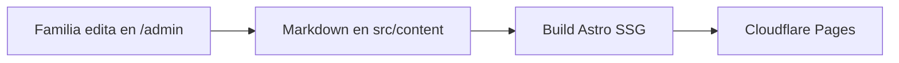

# Viche CANAO — Sitio informativo + Catálogo

> Destilado ancestral del Pacífico colombiano · Delicias del Atrato · Boca de Amé, Chocó

[](https://astro.build)
[](https://tailwindcss.com)
[](https://decapcms.org)
[](https://pages.cloudflare.com)
[](https://pagespeed.web.dev)

Página web escalable del **Viche CANAO**: presenta la marca, su catálogo (Puro, Dorado, Vinete) y funciona como **archivo vivo** de la unidad productiva. Contenido editable sin código, SEO estándar, bilingüe-ready (ES hoy, EN fase 2) y rendimiento de primer nivel.

---

## Índice

1. [La marca](#1-la-marca)
2. [Stack](#2-stack)
3. [Páginas y secciones](#3-páginas-y-secciones)
4. [Estructura del proyecto](#4-estructura-del-proyecto)
5. [Inicio rápido](#5-inicio-rápido)
6. [Editar contenido sin código](#6-editar-contenido-sin-código)
7. [SEO · i18n · Analítica](#7-seo--i18n--analítica)
8. [Presupuesto de rendimiento](#8-presupuesto-de-rendimiento)
9. [Despliegue](#9-despliegue)
10. [Roadmap](#10-roadmap)
11. [Pendientes del cliente](#11-pendientes-del-cliente)
12. [Créditos](#12-créditos)

---

## 1. La marca

| | |
|---|---|
| **Producto** | Viche CANAO — destilado ancestral de caña de las comunidades del Pacífico |
| **Productores** | Oswaldo Martínez Chaverra y su hija Liseth · **Delicias del Atrato** |
| **Origen** | Boca de Amé, Medio Atrato, Chocó |
| **Legado** | +20 años de labor heredada del padre; empresa asociativa de mujeres cabeza de hogar (sus nombres van en cada botella) |
| **Catálogo** | **Puro** cristalino · **Dorado** ámbar · **Vinete** con canela y nuez moscada |
| **Marco legal** | Ley 2158 de 2021 — patrimonio colectivo afrocolombiano · +18, consumo responsable |

---

## 2. Stack

| Decisión | Elección | Por qué |
|---|---|---|
| Sitio | **Astro 4 SSG** + TypeScript estricto | 0 JS por defecto, rapidísimo, SEO nativo |
| Estilos | **Tailwind 3** + tokens propios | Sistema oscuro premium `#0F0D0B` + ámbar `#D9A441` + caña `#7FB069` |
| Contenido | **Decap CMS** + Markdown tipado (Zod) | La familia edita en `/admin` sin tocar código |
| Hosting | **Cloudflare Pages** | Gratis, SSL gratis, previews por PR |
| Calidad | `astro check` + Vitest + Lighthouse ≥ 95 | Cada cambio se verifica antes de integrar |

---

## 3. Páginas y secciones

| Ruta | Contenido |
|---|---|
| `/` | Hero Penumbra + claim + CTAs catálogo/WhatsApp |
| `/historia` | Oswaldo + Liseth, relevo familiar, Delicias del Atrato |
| `/proceso` | Timeline: siembra → corte lunar → trapiche → fermentación 8–15 d → destilación → embotellado |
| `/catalogo` | Grid de 3 fichas con aroma, notas y usos |
| `/catalogo/[slug]` | Ficha + botón WhatsApp con mensaje prellenado |
| `/archivo` | Archivo vivo: historias y noticias editables |
| `/contacto` | WhatsApp, Instagram, ubicación |
| `/404` | Página no encontrada personalizada |

---

## 4. Estructura del proyecto

```text
src/
├── pages/            # / /historia /proceso /catalogo /archivo /contacto /404
├── content/          # Markdown tipado: productos/ + historias/ + config.ts (Zod)
├── components/       # Hero, TimelineProceso, FichaProducto, WhatsAppCTA, GridArchivo…
├── layouts/          # Base.astro (SEO + Header + Footer)
├── i18n/             # es.json (en.json en fase 2)
└── styles/           # global.css (tokens + animaciones CSS)
public/
├── admin/            # Decap CMS (config.yml + index.html)
├── fotos/            # Imágenes comprimidas (<200 KB, hero <400 KB)
tests/                # Vitest: contenido, rutas, rendimiento
docs/superpowers/     # specs/ (diseño) + plans/ (implementación)
```



---

## 5. Inicio rápido

**Prerrequisitos:** Node 20 LTS + npm 10.

```bash
npm install
npm run dev      # desarrollo en http://localhost:4321
npm run check    # tipos + diagnóstico Astro
npm test         # Vitest (7 tests)
npm run build    # build estático en dist/
npm run preview  # vista previa del build
```

---

## 6. Editar contenido sin código

1. Entrar a `https://vichecanao.com/admin`.
2. Editar **Productos** (nombre, aroma, notas, foto, mensaje WhatsApp) o **Archivo** (historias).
3. Guardar → el sitio se reconstruye solo (~1 min).

Alternativa técnica: editar los `.md` de `src/content/` y hacer commit.

> **Fotos:** usar JPG de `Recrusos/` y comprimirlas (ancho máx. 1600 px, calidad ~70) antes de subirlas a `public/fotos/`.

---

## 7. SEO · i18n · Analítica

- **SEO:** títulos y metas por página, canonical, `sitemap.xml`, `robots.txt`, Open Graph, JSON-LD (Organization/Product), un solo H1, `alt` en fotos.
- **i18n:** textos UI en `src/i18n/es.json`; rutas `/en/` en fase 2 sin plugins de pago.
- **Analítica:** Cloudflare Web Analytics (sin cookies) + Search Console. Sin Google Analytics pesado.

---

## 8. Presupuesto de rendimiento

| Métrica | Objetivo | Estado |
|---|---|---|
| JS cliente | < 100 KB | 0 KB (SSG puro) |
| CSS | < 50 KB | ~8 KB |
| Foto contenido | < 200 KB | ✔ |
| Hero | < 400 KB | 243 KB ✔ |
| LCP 4G / CLS / Lighthouse | < 2.5 s / < 0.1 / ≥ 95 | a verificar en prod |

---

## 9. Despliegue

1. Conectar el repo a **Cloudflare Pages**: build `npm run build`, salida `dist/`.
2. Asignar el dominio `.com` y activar SSL.
3. Configurar el token de Web Analytics en `src/layouts/Base.astro` y Search Console.

---

## 10. Roadmap

- **V1 (actual):** informativo + catálogo, ES, Decap, Cloudflare. ✅
- **Fase 2:** inglés completo (`/en/`), más historias del archivo vivo.
- **Futuro:** pedidos avanzados / tienda (requiere registro sanitario INVIMA).

Fuera de alcance V1: carrito, pagos, blog complejo, backend.

---

## 11. Pendientes del cliente

- [ ] Número oficial de WhatsApp (con indicativo) → `src/consts.ts`
- [ ] Confirmación del dominio `.com` (nuevo en Cloudflare o existente)
- [ ] Permiso de uso de fotos (Penumbra / Juan Silva) + textos finales en ES

---

## 12. Créditos

Sitio construido para la familia Martínez y **Delicias del Atrato**, Boca de Amé. Fotografías: Canao × Penumbra y Juan Silva. El viche es patrimonio colectivo de las comunidades negras del Pacífico (Ley 2158 de 2021).
